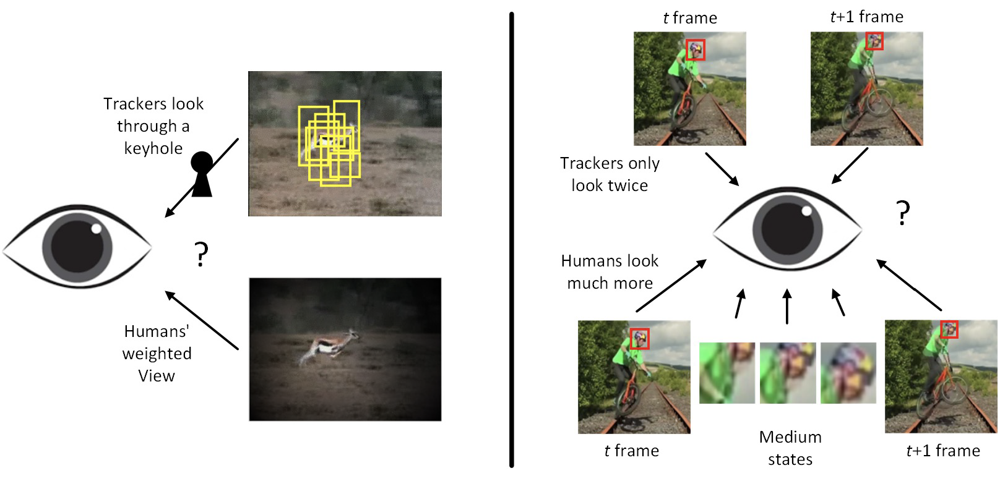
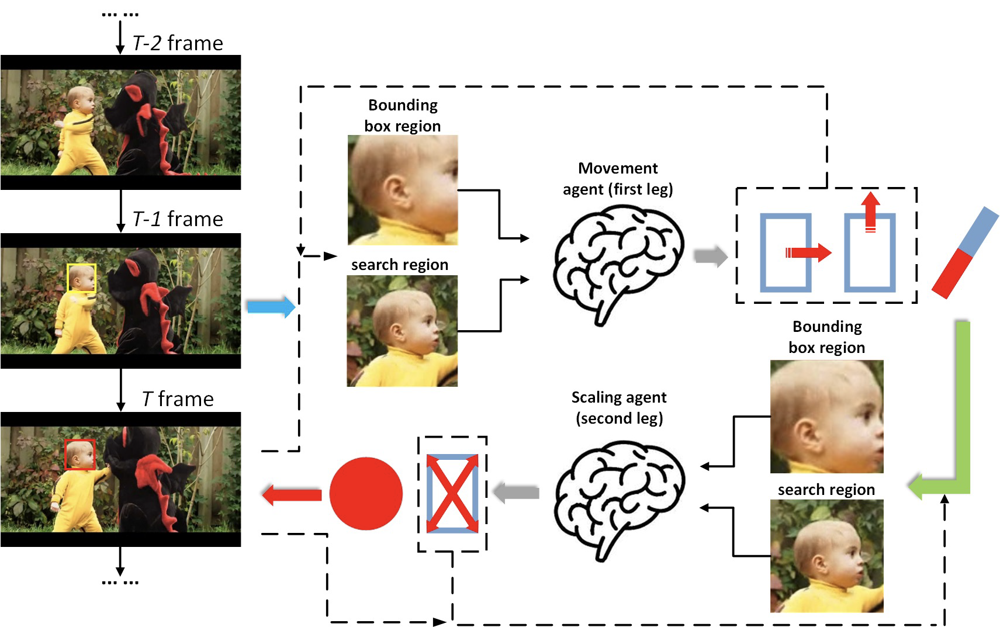
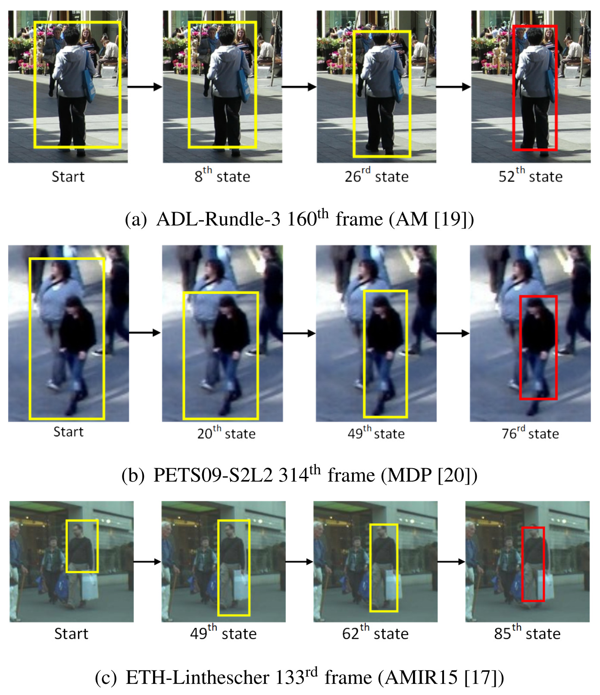

<p align="center">
  
</p>
<p align="center">
Three categories of bounding box error. The state-of-art tracking accuracy is still limited to poor performance due to presence of complex scenes and frequent change of target appearance. Poor performance of object tracking can be attributed largely by the object’s encapsulation with inaccurate bounding box in the form of oversized.
</p>

# Abstract

In this paper, we propose a precise regression approach for correcting imprecise bounding box using deep reinforcement learning. Object tracking task essentially builds trajectory of a moving object based on detection and tracking algorithms and its current state is indicated by having the object encapsulated with a bounding box corresponding to its position and size. However due to the imperfect detection and tracking algorithms operating in complex scene, it is difficult to obtain the precise bounding box as errors frequently occur producing oversized, partial, and false bounding box, respectively. To correct the error, we train an intelligent agent that move the bounding box to the right position and scale it to its correct size matching to that of the true target. The agent is trained by deep Q-learning and evaluated on several state-of-the-art multiple object tracking approaches. The experimental results demonstrate that our proposed framework can effectively eliminate the object tracking bounding box error and its robustness is verified by realizing improved tracking performance in complex scene.

# Overview


<p align="center">

</p>

Error bounding box correction task essentially can be modeled as a framework of Markov decision process (MDP) because the resulting outcome is partly random and partly under the control of a decision maker.  We can exploit this hypothesis to model an agent to make the sequence of decisions. We set a single bounding box region as environment (or observation), so that the agent can make actions to move the bounding box according to the environment. Our proposed method follows a neighborhood search strategy, which starts from a random region near by previous target location and then adjusts position and size to correct target. Above figure illustrates a part of the regression process during tracking a pedestrian.

# Experimental results

<p align="center">
Example sequences of regression procedure.
</p>

# Acknowlegements
This research was supported by Basic Science Research Program through the National Research Foundation of Korea(NRF) funded by the Ministry of Science, ICT & Future Planning (NRF-2017R1A2B4012720)

# Citation
```
@inproceedings{jiang2018precise,
  title={Precise regression for bounding box correction for improved tracking based on deep reinforcement learning},
  author={Jiang, Yifan and Shin, Hyunhak and Ko, Hanseok},
  booktitle={2018 IEEE International Conference on Acoustics, Speech and Signal Processing (ICASSP)},
  pages={1643--1647},
  year={2018},
  organization={IEEE}
}
```
