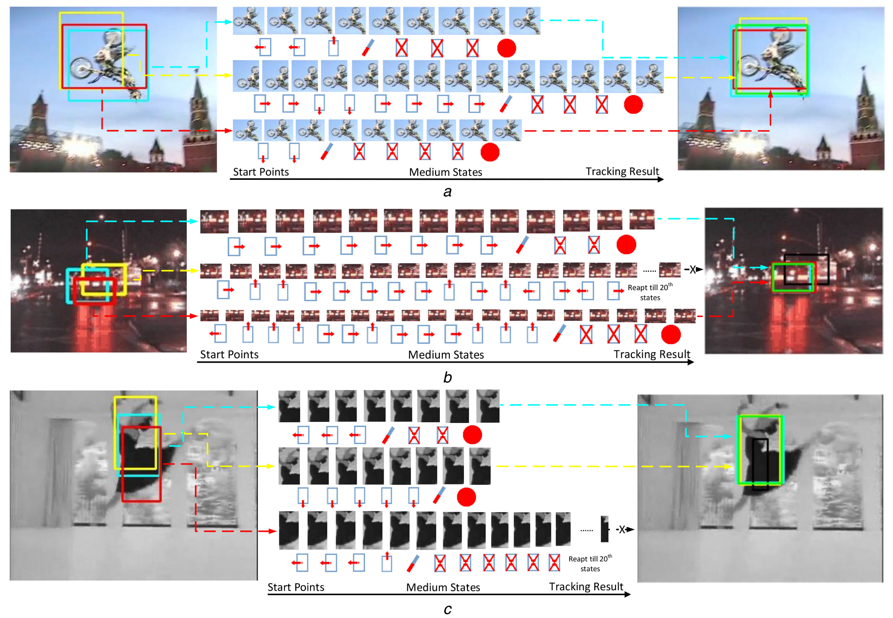

<p align="center">
Limitations of current tracking methods. The left figure depicts the keyhole problem of existing tracking-by-detection trackers; the right figure depicts the jumping problem of existing regression-based trackers.
</p>

# Abstract

A deep reinforcement-learning-based method is presented for visual object tracking tasks. The key objective is to generate a sequence of actions which can move or scale the bounding box in the previous frame to track the target in the current frame. Two intelligent agents are trained to accomplish the above task with a special dueling deep Q-learning network (Dueling DQN), referred to as a relay dueling network. The proposed model is divided into two agents: the movement agent and the scaling agent. The former performs horizontal or vertical movements and the latter generates scaling actions to change the size of the bounding box. The model has multiple inputs that cover both the bounding box region and the enlarged search region to improve the agents’ perception of the surroundings. The proposed method has a broader field of vision than other similar trackers and its distribution of actions makes it easy to train and improve its tracking performance. The proposed network is tested on popular standard tracker benchmarks and its performance is compared with state-of-the-art trackers. The proposed network is found to be competitive in tracking accuracy and execution effectiveness when compared to the conventional methods.


# Overview


<p align="center">
Overview of the RDNet workflow. In this case, the movement agent (the first leg) decides to move the bounding box to the right then up, before handing control to the scaling agent (the second leg). The scaling agent enlarges the bounding box then terminates the entire target searching procedure for the T frame. The blue arrow indicates the start points that are generated according to the target in the previous frame, the green arrow represents the control transfer from the movement to the scaling agent, the gray arrow indicates the process of generating actions, and the red arrow indicates the final tracking result. The dotted lines indicate the intermediate states transformed by the executed actions.
</p>

Our proposed relay dueling network (RDNet) handles visual object tracking tasks by generating a sequence of actions that transfers a bounding box region from a variety of starting points near the target location in the previous frame to the location in the current frame. Figure 2 provides an overview of the RDNet working process. Broadly, a bounding box region and a search region in a random location based on the target in the previous frame are fed into the network. The network then produces a sequence of actions to regress the bounding box towards the current target location by observing and creating intermediate states. More specifically, RDNet consists of two agents: a movement agent and a scaling agent. When the movement agent completes its horizontal or vertical movement actions, it transfers control to the scaling agent. As mentioned, the scaling agent only changes the size of the bounding box and terminates the action when it considers this box to sufficiently enclose the target.

# Experimental results

<p align="center">
Examples of the target search procedure. The start points are represented by three bounding boxes with different colors in the left figure; the three target searching iterations and their intermediate states are shown in the middle; and the right figure depicts the tracking results (final results: green bounding box, failures: black bounding box) and the intermediate states for each iteration, which are distinguished with different colors.
(a) MotorRolling (97th frame), (b) CarDark (293th frame), (c) Dancer (126th frame).
</p>


<p align="center">
The precision and success plots for the OTB50 and OTB100 benchmarks. (a) OTB50 benchmark, (b) OTB100 benchmark.
</p>

# Acknowlegements
This research was supported by the Basic Science Research Program through the National Research Foundation of Korea (NRF) funded by the Ministry of Science, ICT & Future Planning (NRF-2017R1A2B4012720).

# Citation
```
@article{jiang2019relay,
  title={Relay dueling network for visual tracking with broad field-of-view},
  author={Jiang, Yifan and Han, David K and Ko, Hanseok},
  journal={IET Computer Vision},
  volume={13},
  number={7},
  pages={615--622},
  year={2019},
  publisher={IET}
}
```
